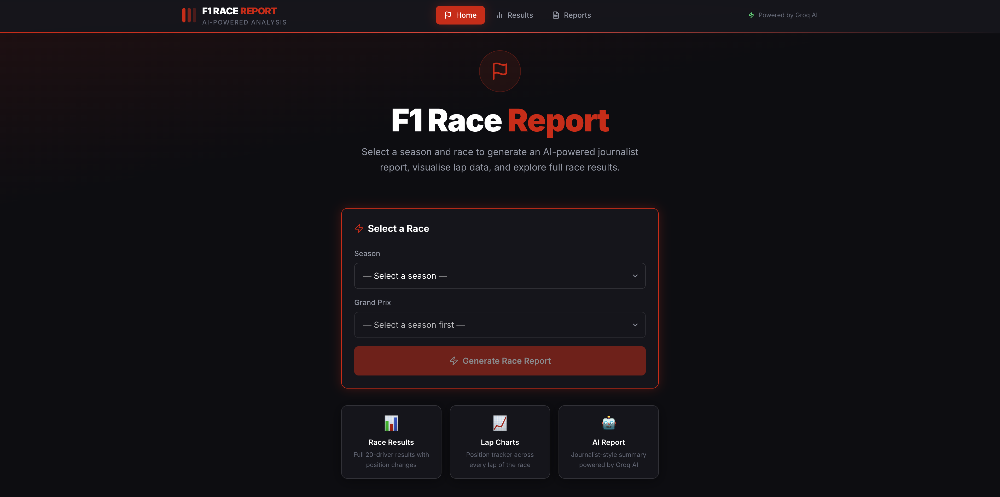
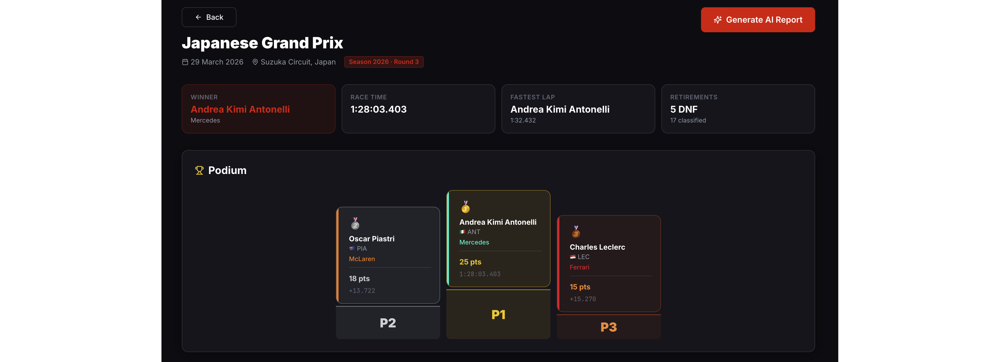
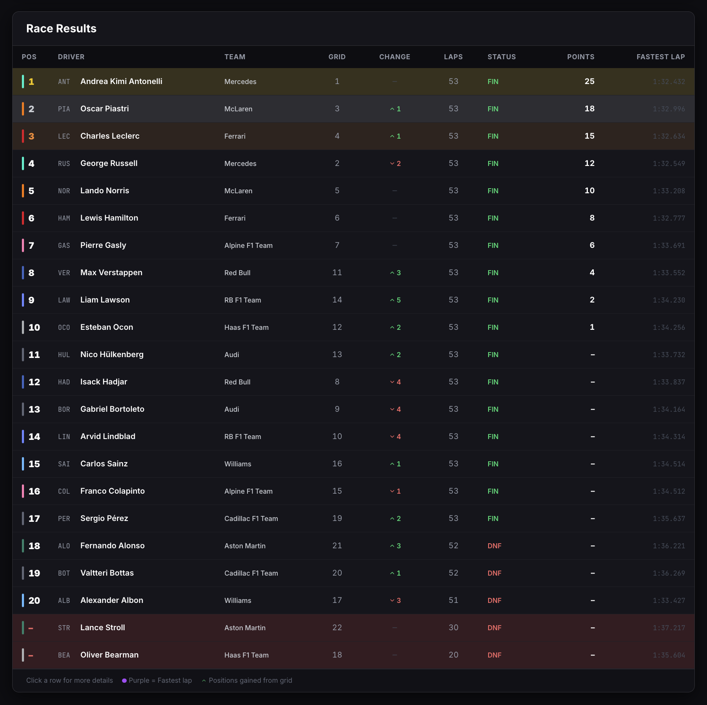
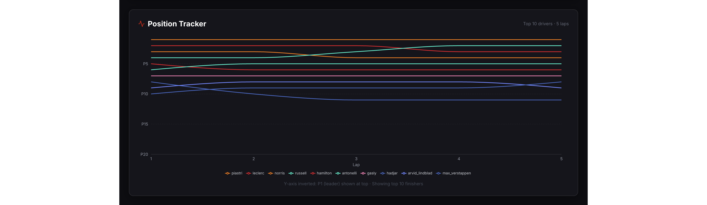
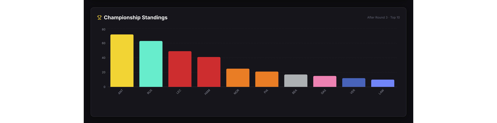
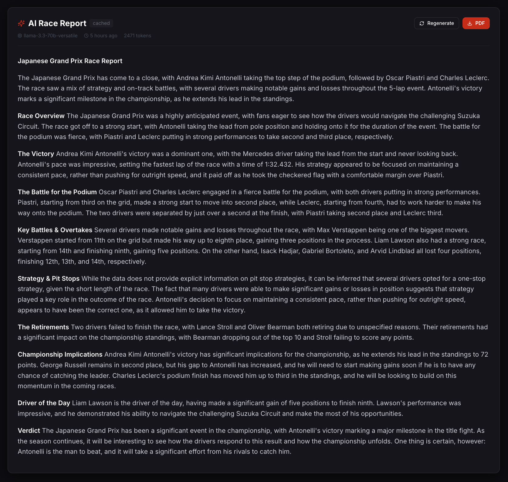
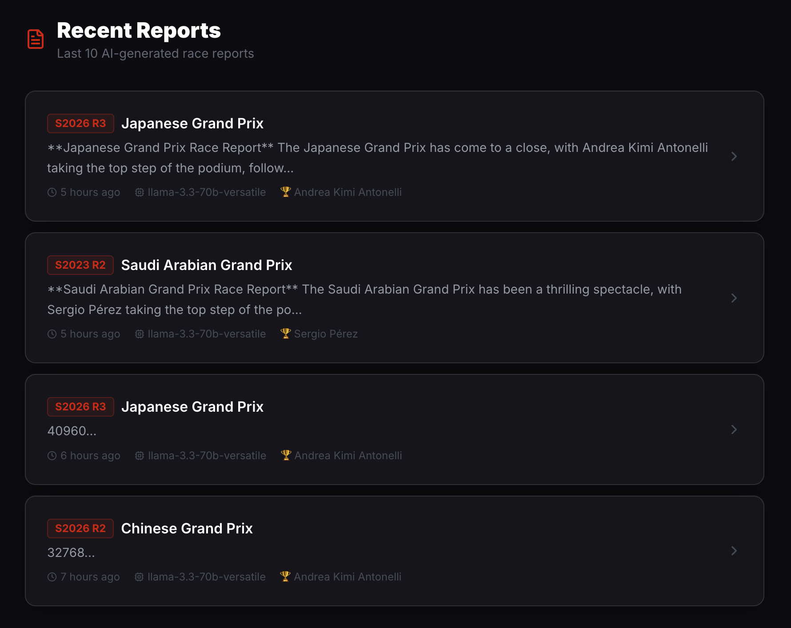

<div align="center">

<!-- F1 Racing Banner -->


# 🏎️ F1 Race Report Tool

### AI-powered Formula 1 race analysis · Live charts · Journalist-style reports

[](https://f1-race-report.vercel.app)
[](https://render.com)
[](https://vercel.com)
[](https://vercel.com)
[](LICENSE)

<br/>

[](https://ko-fi.com/W7W31XIH60)

<br/>




</div>

---

## ⚡ What is this?

> Select any Formula 1 race from **1950 to 2026**, and get an instant AI-generated race report written like a professional journalist — complete with lap charts, podium display, full results table, and championship standings.

**Powered by:**
- 🏁 **Jolpica F1 API** — race data, lap times, standings
- 🤖 **Groq AI (llama-3.3-70b-versatile)** — journalist-style race reports
- 🗄️ **Neon PostgreSQL** — persistent storage for races and reports

---

## 📸 Screenshots

<div align="center">

### 🏆 Podium & Race Summary


### 📋 Full Race Results Table


### 📈 Lap-by-Lap Position Tracker


### 🏅 Championship Standings


### 🤖 AI Race Report


### 📁 Report History


</div>

---

## 🧠 Architecture

```
┌─────────────────────────────────────────────────────────────┐
│                        MONOREPO                             │
│                   f1-race-report/                           │
│              ┌──────────┬──────────┐                        │
│              │ frontend │ backend  │                        │
│              └────┬─────┴────┬─────┘                        │
└───────────────────┼──────────┼──────────────────────────────┘
                    │          │
          Vercel    │          │   Render
     ───────────────┘          └──────────────
     React + Vite                Spring Boot
     Tailwind CSS                Java 21
     Recharts                    PostgreSQL (Neon)
          │                           │
          │      HTTPS / JSON         │
          └───────────────────────────┘
                    │          │
          ┌─────────┘          └──────────┐
          │                              │
   Jolpica F1 API               Groq AI API
   (Race Data)              (Report Generation)
```

### Request Flow
```
User selects race
      │
      ▼
React (Vercel) ──GET /api/race-data──► Spring Boot (Render)
                                              │
                                    ┌─────────┴──────────┐
                                    │                    │
                              Check Neon DB         Jolpica API
                              (cached?)             (if not cached)
                                    │                    │
                                    └─────────┬──────────┘
                                              │
                                    Assemble RaceDataDTO
                                              │
                                    ◄─────────┘
                                    Return to React
                                              │
User clicks "Generate AI Report"              │
      │                                       │
      ▼                                       │
POST /api/generate-report                     │
      │                                       │
      ▼                                       │
  Groq AI ──────────────────────────────────► │
  (llama-3.3-70b-versatile)                   │
      │                                       │
  Report stored in Neon DB                    │
      │                                       │
  Returned to React ◄──────────────────────── ┘
```

---

## 🛠️ Tech Stack

### Backend
| Technology | Purpose |
|---|---|
| **Spring Boot 3.2.5** | REST API framework |
| **Java 21** | Runtime |
| **Gradle** | Build tool |
| **Spring Data JPA + Hibernate** | ORM / Database layer |
| **PostgreSQL (Neon)** | Cloud database |
| **HikariCP** | Connection pooling |
| **Caffeine Cache** | In-memory caching |
| **OpenPDF** | PDF report export |
| **Groq API** | AI text generation |
| **Jolpica F1 API** | Race data source |
| **Lombok** | Boilerplate reduction |

### Frontend
| Technology | Purpose |
|---|---|
| **React 18** | UI framework |
| **Vite** | Build tool & dev server |
| **Tailwind CSS** | Styling |
| **Recharts** | Data visualisation |
| **React Router v6** | Client-side routing |
| **Axios** | HTTP client |
| **react-markdown** | AI report rendering |
| **react-hot-toast** | Notifications |
| **lucide-react** | Icons |

---

## 🚀 Getting Started (Local)

### Prerequisites
- Java 21
- Node.js 18+
- PostgreSQL (or a [Neon](https://neon.tech) free account)
- [Groq API key](https://console.groq.com) (free)

### 1. Clone the repo
```bash
git clone https://github.com/venomyzer/f1-race-report.git
cd f1-race-report
```

### 2. Backend setup
```bash
cd backend

# Copy and configure properties
cp src/main/resources/application.properties.example \
   src/main/resources/application.properties

# Edit with your values
nano src/main/resources/application.properties
```

Set these values:
```properties
spring.datasource.url=jdbc:postgresql://localhost:5432/f1reportdb
spring.datasource.username=your_pg_username
spring.datasource.password=your_pg_password
groq.api.key=gsk_your_groq_key_here
```

```bash
# Create the database
createdb f1reportdb

# Run the backend
./gradlew bootRun
```

Backend starts at `http://localhost:8080`

### 3. Frontend setup
```bash
cd frontend

# Install dependencies
npm install

# Configure environment
cp .env.example .env
# Edit .env → set VITE_API_BASE_URL=http://localhost:8080

# Start dev server
npm run dev
```

Frontend starts at `http://localhost:5173`

---

## 🌐 API Reference

All responses follow this shape:
```json
{
  "success": true,
  "message": "OK",
  "data": { ... },
  "statusCode": 200
}
```

| Method | Endpoint | Description |
|--------|----------|-------------|
| `GET` | `/api/seasons` | All F1 seasons (1950–2026) |
| `GET` | `/api/races?season=2024` | All races for a season |
| `GET` | `/api/race-data?season=2024&round=1` | Full race data payload |
| `POST` | `/api/generate-report` | Generate AI race report |
| `GET` | `/api/reports` | Recent 10 reports |
| `GET` | `/api/reports/{id}` | Specific report by ID |
| `GET` | `/api/export-pdf/{id}` | Download report as PDF |
| `GET` | `/actuator/health` | Health check |

### Example: Generate a report
```bash
curl -X POST https://your-backend.onrender.com/api/generate-report \
  -H "Content-Type: application/json" \
  -d '{"season": 2024, "round": 1, "forceRegenerate": false}'
```

---

## 🗄️ Database Schema

```sql
drivers        → F1 driver profiles
races          → Grand Prix events (season + round)
race_results   → Per-driver finishing data (FK → races, drivers)
reports        → AI-generated race reports (TEXT)
```

---

## 💾 Caching Strategy

| Cache | TTL | Reason |
|-------|-----|--------|
| `seasons` | 24 hours | Changes once a year |
| `races` | 6 hours | Stable during season |
| `raceResults` | 12 hours | Immutable after race |
| `lapData` | 12 hours | Immutable after race |
| `standings` | 6 hours | Updates each race |

---

## 🚢 Deployment

| Service | Platform | URL |
|---------|----------|-----|
| Frontend | Vercel | https://f1-race-report.vercel.app |
| Backend | Render | your-backend.onrender.com |
| Database | Neon | PostgreSQL (Singapore region) |

### Environment Variables

**Backend (Render):**
```
DB_URL=jdbc:postgresql://...
DB_USERNAME=...
DB_PASSWORD=...
GROQ_API_KEY=gsk_...
GROQ_MODEL=llama-3.3-70b-versatile
PORT=10000
```

**Frontend (Vercel):**
```
VITE_API_BASE_URL=https://your-backend.onrender.com
```

---

## 📁 Project Structure

```
f1-race-report/
├── backend/
│   ├── src/main/java/com/f1report/
│   │   ├── config/          # CORS, Cache, RestTemplate
│   │   ├── controller/      # REST endpoints
│   │   ├── service/         # Business logic + AI + PDF
│   │   ├── repository/      # Spring Data JPA
│   │   ├── model/           # JPA entities
│   │   └── dto/             # Request/Response objects
│   ├── build.gradle
│   └── Dockerfile
│
├── frontend/
│   ├── src/
│   │   ├── components/      # UI components
│   │   ├── pages/           # Route pages
│   │   ├── hooks/           # Custom React hooks
│   │   ├── services/        # Axios API layer
│   │   └── utils/           # Helpers, formatters
│   ├── package.json
│   └── vite.config.js
│
└── README.md
```

---

## ⚠️ Known Limitations

- **Render free tier** spins down after inactivity — first request may take ~50 seconds to wake up
- **Lap data** not available for races before ~2012 (Ergast API limitation)
- **2026 season** races not yet completed (future rounds return no data)

---

## 🙏 Credits

- [Jolpica F1 API](https://api.jolpi.ca) — The open-source successor to Ergast
- [Groq](https://groq.com) — Ultra-fast LLM inference
- [Neon](https://neon.tech) — Serverless PostgreSQL

---

<div align="center">


**Built with ❤️ and too much coffee by [venomyzer](https://github.com/venomyzer)**

[](https://ko-fi.com/W7W31XIH60)

[](https://github.com/venomyzer/f1-race-report)
[](https://f1-race-report.vercel.app)


*Not affiliated with Formula 1, the FIA, or any F1 team.*

</div>